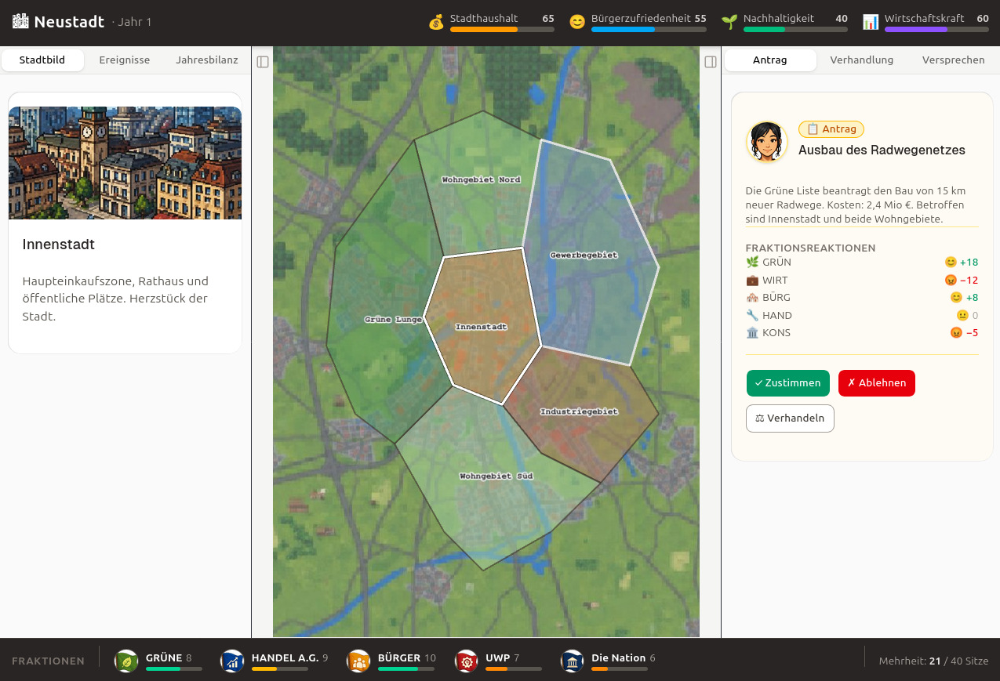

# 🏛️ TownSim: Serious Politics

TownSim is a browser-based political simulation and **Serious Game** that puts you in the mayor's seat of a fictional democratic city with 80,000 citizens. Your goal is to navigate the complex world of local politics, balancing competing interests across a four-year legislative term.

> [!IMPORTANT]
> The game is under development and **currently available in German only**.

🚀 [Click here to play in the browser](https://devolt5.github.io/townsim/)

## 🎮 What to Expect

* **⚖️ Tough Choices:** Navigate decision cards where no perfect solution exists. Every "Yes" for one group is a "No" for another.
* **📊 Dynamic Metrics:** Balance four core pillars: **Stadthaushalt** (Budget), **Bürgerzufriedenheit** (Satisfaction), **Nachhaltigkeit** (Sustainability), and **Wirtschaft** (Economy).
* **🤝 Faction Management:** Work with 5 distinct political factions—from the Green List to the Business Forum. Organize majorities and manage your "Political Capital."
* **📜 Promises & Trust:** The game remembers what you promised. Keeping your word builds trust; breaking it leads to political isolation.

## 🎓 A Serious Learning Experience

Unlike traditional city builders, TownSim focuses on the **human and political side of governance**. It is designed to illustrate why political compromises are difficult and necessary. You will face unpredictable events—from extreme weather 🌊 to economic shifts 📈—that challenge your strategy and ethics.

## 🗳️ Re-election & Reflection

At the end of your term, you face the voters. Whether you are re-elected or voted out, TownSim providing a detailed **reflection screen** that analyzes your tenure, highlighting successes and pointing out where promises were left behind. It’s not just about winning; it’s about understanding the trade-offs of democracy.
